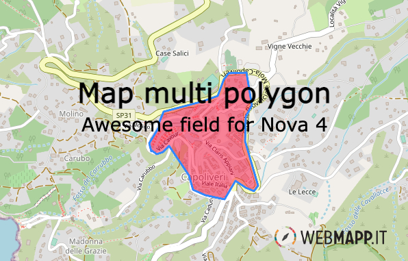

---

[](https://packagist.org/packages/wm/map-multi-polygon)

- [Requirements](#requirements)
- [Installation](#installation)
- [Develop](#develop)
- [Usage](#usage)
  - [Map Point](#map-point)
- [Configuration](#configuration)

## Requirements

- `php: ^8` 
- `laravel/nova: ^4`

## Installation

You can install the package in to a Laravel app that uses [Nova](https://nova.laravel.com) via composer:

```bash
composer require wm/map-multi-polygon
```

## Develop
create a```nova-components``` folder in the root of the project where you want to develop.
Clone map-multi-polygon inside.
add  in ``` "repositories"``` array  attribute of ```composer.json```  
```php 
        {
            "type": "path",
            "url": "./nova-components/map-multi-polygon"
        }
```

modify  in ``` "requires"``` object  attribute of ```composer.json```  
```php 
    "wm/map-multi-polygon": "*",
```
in the first time

launch inside the repository hosting the field
```bash
    cd vendor/laravel/nova && npm install
```
we need modify composer.lock 
launch
```bash
    composer update wm/map-multi-polygon
```

launch inside field
```bash
    npm install
```


## Usage

### Map Point


You can display a post gist geography(MultiPolygon,4326) area on the map and change it by uploading a new MultiPolygon file (.GPX, .KML, .GEOJSON)

```php
    use Wm\MapMultiPolygon\MapMultiPolygon;
    /**
     * Get the fields displayed by the resource.
     *
     * @param  \Laravel\Nova\Http\Requests\NovaRequest  $request
     * @return array
     */
    public function fields(NovaRequest $request)
    {
        return [
            ID::make()->sortable(),
                ...
            MapMultiPolygon::make('geometry')->withMeta([
                'center' => ['42.795977075', '10.326813853'],
                'attribution' => '<a href="https://webmapp.it/">Webmapp</a> contributors',
            ]),
        ];
    }
```
## Configuration

As of v1.4.0 it's possible to use a `Tab` class instead of an array to represent your tabs.

<div style="overflow-x:auto;">
  <table style="width: 100%">
    <thead>
      <tr>
        <th>Property</th>
        <th>Type</th>
        <th style="width: 10%;">Default</th>
        <th>Description</th>
      </tr>
    </thead>
    <tbody>
      <tr>
        <td>center</td>
        <td>array</td>
        <td>[0,0]</td>
        <td>The coordinates used to center the view of an empty map.</td>
      </tr>
      <td>attribution</td>
        <td>string</td>
        <td>'&lt;a href="https://www.openstreetmap.org/"&gt;OpenStreetMap&lt;/a&gt; contributors, &lt;a href="https://creativecommons.org/licenses/by-sa/2.0/"&gt;CC-BY-SA&lt;/a&gt;, Imagery (c) &lt;a href="https://www.mapbox.com/"&gt;Mapbox&lt;/a&gt;'</td>
        <td>The HTML content displayed as map attribution.</td>
      <tr>
        <td>tiles</td>
        <td>string</td>
        <td>'https://{s}.tile.openstreetmap.org/{z}/{x}/{y}.png'</td>
        <td>The tile URL used for the map.</td>
      </tr>
    </tbody>
  </table>
</div>
